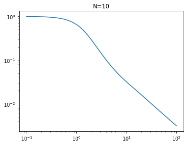
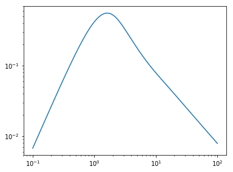
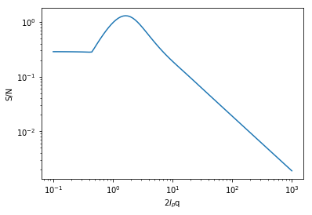

```python
from scatter import *
```

# Example 1: Structure factor of semiflexible polymer


```python
N=10 # number of Kuhn steps per chain
KV = np.logspace(-1,2,100) # wavevector in unit of 1/(Kuhn step)

S = scatter_pol(KV, N)
```


```python
plt.figure(figsize=(6,4.5))
plt.title('N='+str(N))
plt.loglog(KV, S, label='$I_{2}$')
plt.show()
```





# Example 2: Scattering of polymer melt


```python
N=10 # number of Kuhn steps per chain
KV = np.logspace(-1,2,100) # wavevector in unit of 1/(Kuhn step)

FA=0.5 # fraction of A-type segment
CHI = 0 # Flory-Huggins parameter between A-B monomers

S = scatter_copol(KV, N, FA, CHI)
```


```python
plt.figure(figsize=(6,4.5))
plt.loglog(KV, S, label='$I_{2}$')
plt.show()
```





# Example 3: Scattering of copolymer solutions


```python
N=10
FA=0.4
CHIAB, CHIAS, CHIBS = 0, 0, 0
PHIP = 0.2

KV = np.logspace(-1,3,100)
S = scatter_sol(KV, N, FA, PHIP, CHIAB, CHIAS, CHIBS)
```


```python
plt.loglog(KV, 1./(N*S)/PHIP)
plt.ylabel('S/N')
plt.xlabel('2$l_p$q')
plt.show()
```





```python

```
